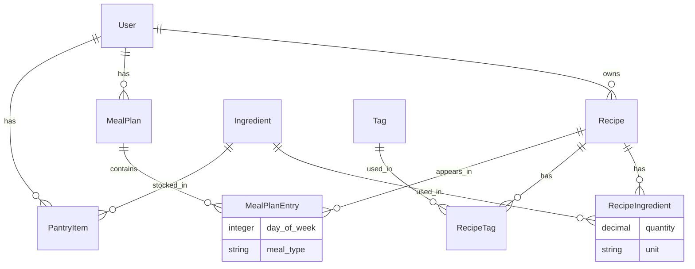

# RecipeBox

A personal recipe management app built with Ruby on Rails. You tell it what ingredients you have, it finds recipes you can make, you plan your week on a meal calendar, and it generates a shopping list for what's missing.

**Live demo:** _coming soon (Fly.io / Render deployment)_
**Demo login:** `demo@recipebox.dev` / `password123`

---

## Features

- **Ingredient-based search** — type ingredients you have, get back matching recipes
- **Recipe management** — create, edit, and share recipes with photos, instructions, and ingredient lists
- **Weekly meal planner** — drag recipes onto a Mon–Sun calendar with breakfast, lunch, and dinner slots
- **Auto shopping list** — aggregates all required ingredients across the meal plan, subtracts what you own, produces a clean printable list
- **Tagging & filtering** — tag recipes (vegetarian, quick, Italian, etc.) and filter the index by tag

---

## Tech Stack

| Layer | Choice |
|---|---|
| Framework | Ruby on Rails 8.1 (full-stack monolith) |
| Database | PostgreSQL 16 (Supabase) |
| Frontend | ERB + Hotwire/Turbo (no separate JS framework) |
| Auth | Devise |
| File uploads | Active Storage |
| Background jobs | Sidekiq |
| Testing | RSpec + FactoryBot + Shoulda Matchers |
| Deployment | Fly.io / Render |

---

## Data Model



### Key design decisions

**Ingredients are normalized, not stored as text.**
`Ingredient` is its own table, joined to `Recipe` through `RecipeIngredient` with `quantity` and `unit` columns. This is what makes the ingredient search, pantry comparison, and shopping list aggregation possible. Storing ingredients as a text field would make all three features either impossible or unreliable.

**`RecipeIngredient` groups by `[ingredient_id, unit]` for aggregation.**
Two recipes that each require flour in cups get their quantities summed. The same ingredient measured in cups vs tablespoons stays on separate rows — no implicit unit conversion, which would require a conversion table and introduce error.

**`ShoppingListCalculator` is a service object, not a controller action.**
The calculation logic lives in `app/services/shopping_list_calculator.rb`. This keeps `ShoppingListsController#show` to two lines, makes the algorithm independently testable, and means it can be reused by the weekly summary email without touching a controller.

**Pantry subtraction is binary.**
If a user owns an ingredient, the entire ingredient row is removed from the shopping list regardless of quantity. Quantity-aware subtraction would require unit conversion (1 cup vs 250ml of the same ingredient) — that's a scope expansion that would add complexity without proportional value for a weekly planning tool.

**`MealPlan` enforces one plan per user per week via a unique index.**
`[user_id, week_start_date]` is unique at the database level, not just the model level. `week_start_date` is validated to always be a Monday. `find_or_create_by!` is used throughout so navigating to "my meal plan" always works without manual creation.

---

## Shopping List Algorithm

```
MealPlan
  └── MealPlanEntries (eager loaded with recipe → recipe_ingredients → ingredient)
        └── All RecipeIngredients across the week
              │
              ▼
        Group by [ingredient_id, unit]
        Sum quantities within each group
              │
              ▼
        Reject any ingredient the user owns (PantryItem lookup)
              │
              ▼
        Sort alphabetically by ingredient name
              │
              ▼
        Shopping list
```

---

## Local Setup

**Requirements:** Ruby 3.3, PostgreSQL (or a Supabase project)

```bash
# Clone and install dependencies
git clone https://github.com/your-username/recipe-box.git
cd recipe-box
bundle install

# Configure environment
cp .env.example .env
# Fill in DATABASE_URL in .env

# Set up database and seed data
rails db:migrate
rails db:seed

# Start the server
bin/dev
```

The app runs at `http://localhost:3000`. Seed data creates a demo user and 10 public recipes across 45 ingredients and 8 tags.

---

## Running Tests

```bash
bundle exec rspec
```

The test suite covers:

- Model validations and associations for all 8 models
- The `matching_ingredients` scope (case-insensitivity, OR matching, no duplicates)
- The `tagged_with` scope
- `tag_names=` writer (find-or-create, normalisation, replacement)
- `ShoppingListCalculator` — quantity aggregation, mixed units, pantry subtraction, empty plan, full pantry, sort order

```
80 examples, 0 failures
```

---

## Project Structure

```
app/
├── controllers/
│   ├── recipes_controller.rb          # Thin — 7 actions, delegates logic
│   ├── meal_plans_controller.rb
│   ├── meal_plan_entries_controller.rb
│   └── shopping_lists_controller.rb   # 2-line show action
├── models/
│   ├── recipe.rb                      # Core domain model
│   ├── ingredient.rb                  # Normalized — never a text field
│   ├── recipe_ingredient.rb           # quantity + unit on the join table
│   ├── meal_plan.rb                   # Enforces Monday constraint
│   ├── meal_plan_entry.rb             # day_of_week + meal_type slot
│   ├── pantry_item.rb
│   ├── tag.rb
│   └── recipe_tag.rb
└── services/
    └── shopping_list_calculator.rb    # The hard problem, solved here

spec/
├── models/                            # Full coverage for all 8 models
├── services/
│   └── shopping_list_calculator_spec.rb  # Most important test file
└── factories/                         # One factory per model
```

---

## What I'd Build Next

- **Quantity-aware pantry** — track how much of each ingredient you own, not just whether you own it
- **System tests** — end-to-end coverage for the ingredient search → meal plan → shopping list flow
- **Weekly summary email** — Sidekiq + Action Mailer, delivered Sunday night via Sendgrid
- **Public recipe discovery** — browse other users' public recipes, not just your own
